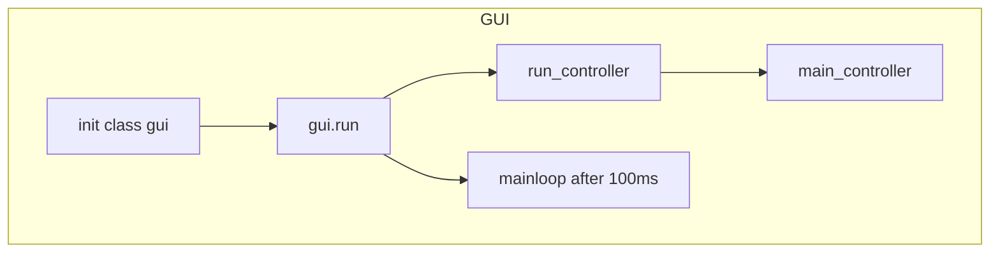
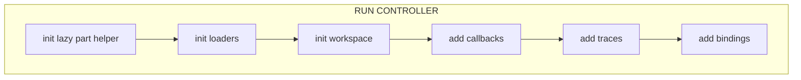
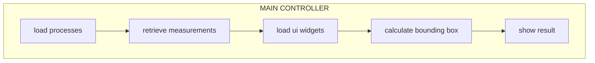

# application flowchart

```mermaid
flowchart
    subgraph GUI
        A1[init class gui] --> A2[gui.run]
        A2 --> A3[run_controller]
        A3 --> A4[main_controller]
        A2 --> Z[mainloop after 100ms]
    end
```

```mermaid
flowchart
    subgraph RUN CONTROLLER
        B2[init lazy part helper] --> B3[init loaders]
        B3 --> B4[init workspace]
        B4 --> B5[add callbacks]
        B5 --> B6[add traces]
        B6 --> B7[add bindings]
    end
```

```mermaid
flowchart
    subgraph MAIN CONTROLLER
        C1[load processes] --> C2[retrieve measurements]
        C2 --> C3[load ui widgets]
        C3 --> C4[calculate bounding box]
        C4 --> C5[show result]
    end
```
